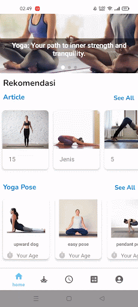

<h1>youGo-App Introduction</h1>
youGo-App introduces features such as BMI-based yoga pose recommendations and yoga movement scanning. Our app aims to make it easy for beginners to evaluate their yoga moves whether they are correct or not just through the phone. Users will upload photos of the moves they want to be evaluated and the app will give feedback in the form of generating the accuracy of the movement performed. The motivating factor of our team is to make yoga accessible and effective for individuals who want to practice at home. We understand the important role of proper yoga guidance and its potential to transform physical and mental well beings.

## Features
- Register and login: users can create and log in to their account via their personal email and password.
- Article: Users can read yoga-related articles provided in the app.
- Various yoga positions: users can choose various kinds of yoga poses that they want to practice, on the page of each pose, steps are provided on how to do the pose correctly.
- Yoga pose accuracy assessment: each yoga pose has an accuracy assessment feature where the user simply takes a photo or sends a photo of the yoga pose performed, then the application will give a score for the accuracy of the pose performed.
- Timer: users can do yoga by setting the preferred duration through the timer feature that has been provided
- Pose recommendations based on BMI: users can get pose recommendations based on their BMI.

## How to install the application
1. User can download the application file first at the link [here](https://drive.google.com/drive/folders/1Psch0aL4_ZSOkD9sqA4damknd_2koI9p?usp=sharing)
2. Authenticate yourself by logging in or registering an account using your email and password if you don't already have an account.
3. Allow camera access to the application. 
4. You can already choose the type of yoga you want to do, get recommendations for yoga poses based on BMI, or read articles provided by the application.

<h1>YouGoApp Documentation</h1>

This documentation is for user of this app.
The documentation for each learning path can be found by switching to the branch of each path. 

### REGISTER

Users must enter an email and password to register their account. The email must be in the correct format and the password must consist of 6 characters.

### LOGIN

Users can login by entering the email and password that has been registered previously.

### MAIN

After logging in, users can access the main page of the app. On the page there is a choice of articles and yoga poses that can be practiced. There is also a navbar that directs users to the article page, the BMI calculator, and the user account. 

### ARTICLES

On this page, users can choose and search for articles they want to read.

### YOGA POSE

On this page, users can select and search for the pose they want to practice. On this page, there are also steps to guide users to do the movements properly. Once you are ready, you can set the duration and start doing yoga. 

### CHECK YOUR POSE

You can check your pose is correct or not through the accuracy assessment feature. You can simply take a photo of yourself when doing some yoga pose or upload an existing photo of yourself when doing some yoga pose. Then the app will show your pose accuracy score. Through this score, you can improve your pose for future practice.

### CHECK YOUR BMI

Simply by inputting your height, weight and age, you can check your BMI, know your body mass index status, and get any yoga pose recommendations for improving your health. 

