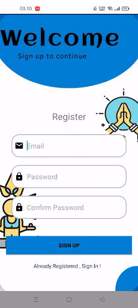
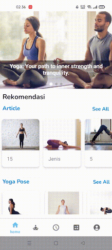
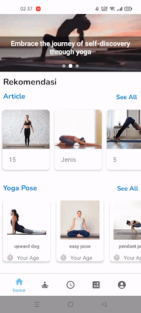
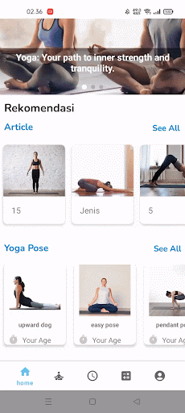

# YouGoApp Documentation

This documentation is for user of this app.

 
 

`REGISTER`

user must input email and password for their account, email must be in correct format and password must be 6 characters long

 
 

`LOGIN`

User must input correct email and password in order to use the application

 
 

`MAIN`

After Login The user can see the main page of application, there are articles and yoga pose training

 
 

`ARTICLES`

This is articles page, you can search any articles you want

 
 

`YOGA POSE`

There are lot of yoga pose, you can  choose it for your training purpose

 
 

`CHECK YOUR POSE`

There are lot of yoga pose, you can  choose it for your training purpose

 
 

