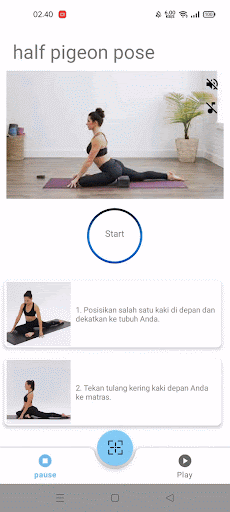

# YouGoApp Documentation

This documentation is for user of this app.

 
 

<h2>REGISTER</h2>

user must input email and password for their account, email must be in correct format and password must be 6 characters long

 
 

<h2>LOGIN</h2>

User must input correct email and password in order to use the application

 
 

<h2>MAIN</h2>

After Login The user can see the main page of application, there are articles and yoga pose training

 
 

<h2>ARTICLES</h2>

This is articles page, you can search any articles you want

 
 

`YOGA POSE`

There are lot of yoga pose, you can  choose it for your training purpose

 
 

<h2>CHECK YOUR POSE</h2>

you can check your pose is correct or not. photo yourself when doing some yoga training or upload existing photo of your when doing some yoga training 

 
 

<h2>CHECK YOUR BMI</h2>

you can check your bmi, knowing your body mass index status and get any recomendation for improving your health

 
 

